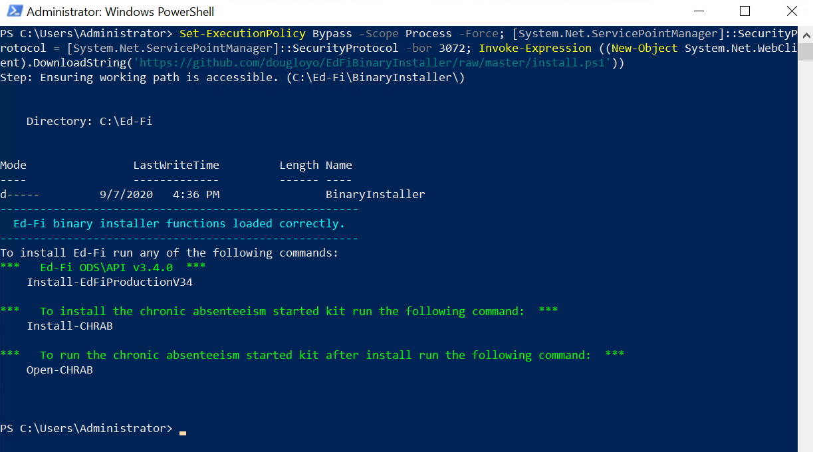
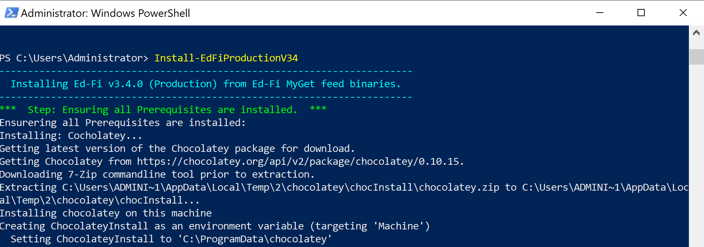
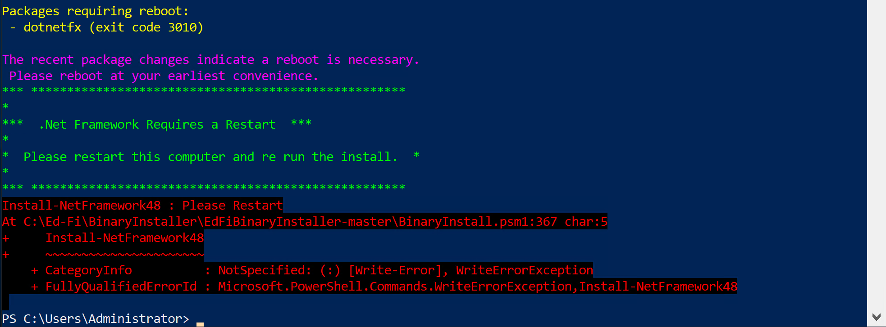
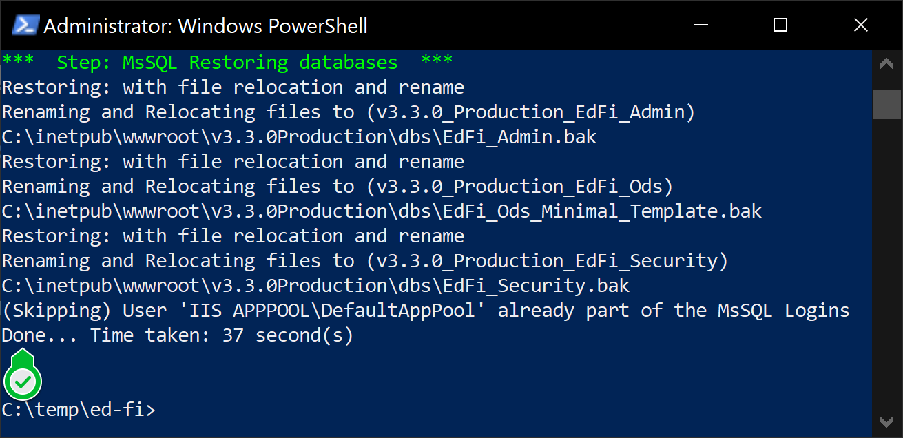
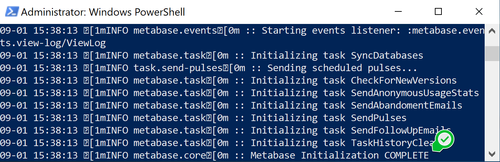
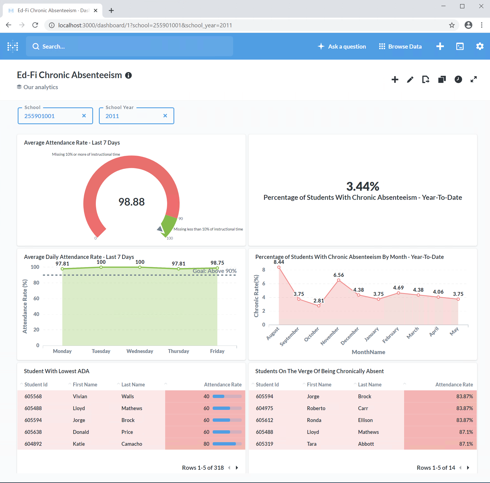

# PowerShell Ed-Fi Chronic Absenteeism Starter Kit


These scripts were made possible thanks to the Michael and Susan Dell Foundation.

## Description

These PowershellScripts install the public Ed-Fi binaries published on the MyGet feed. Additionally, they install the Metabase Chronic Absenteeism Starter Kit.

* v3.4.0 Ed-Fi ODS\API bianries can be found here: https://techdocs.ed-fi.org/pages/viewpage.action?pageId=68070805
* You can learn more about Metabase here: https://www.metabase.com/


## Prerequisites
### Minimum System Requirements
A machine or virtual machine with internet access.

* 50GB free storage space
* 4GB+ of available RAM
* Windows Server 2019
* Administrator access to physical machine or virtual machine

### Software Requirements

* MsSQL Server 2019 or higher
* IIS - Internet Information Services
* .Net Framework 4.8. (Restart will be required if not previously installed.)

That is it =)


## Setup Instructions

**1)** Open a Windows PowerShell as and Administrator.
From the **Windows Menu**, search for **PowerShell**, right click on it, and select **Run as Administrator**
<br/>

**2)** Run the automated installer by pasting this command in to the PowerShell window:
> Set-ExecutionPolicy Bypass -Scope Process -Force; [System.Net.ServicePointManager]::SecurityProtocol = [System.Net.ServicePointManager]::SecurityProtocol -bor 3072; Invoke-Expression ((New-Object System.Net.WebClient).DownloadString('https://github.com/Ed-Fi-Exchange-OSS/Ed-Fi-MetabaseChronicAbsenteeismQuickStart/raw/main/install.ps1'))

It will download all necessarry scripts and display an install menu like the image below:
<br/>

**3)** Run the Ed-Fi v3.4.0 installer by pasting this command in to the PowerShell window:

```PowerShell
Install-EdFiProductionV34
```
You will see the script executing. It will check  for prerequisites and install as needed. (Sample image below)
<br/>

This part of the installer will take about 10-30 mins to download and install the components of this solution.

***NOTE:** If you dont have .Net Framework 4.8 it will install it for you, however it will require a restart.

***After the restart redo step 1, 2 & 3.**
<br/>


**4)** Once the Ed-Fi install finishes you will see a screen like the one bellow: "Confirms Done"
<br/>


## Installing the Chronic Absenteeism Quick Start

On the same machine where you installed the latest Ed-Fi run the following commands:

**1)** Run the setup script by pasting this command in to the PowerShell window:

> Set-ExecutionPolicy Bypass -Scope Process -Force; [System.Net.ServicePointManager]::SecurityProtocol = [System.Net.ServicePointManager]::SecurityProtocol -bor 3072; Invoke-Expression ((New-Object System.Net.WebClient).DownloadString('https://github.com/Ed-Fi-Exchange-OSS/Ed-Fi-MetabaseChronicAbsenteeismQuickStart/raw/main/install.ps1'))

**2)** Run the "Chronic Absenteeism Quick Start" installer by pasting this command in to the PowerShell window:
```PowerShell
Install-CHRAB
```
This part of the installer will take about 25 mins to download and install the components of your solution.

You will know it is done when you see the following text in the powershell.
<br/>

**3)** Open the google chrome browser and navigate to http://localhost:3000
This will lopen Metabase. Use the following credentialls to login:
- User: test@ed-fi.org
- Pass: EdfiUs3r

You will see a dashboard like the image below:
<br/>

# About the MSDF Chronic Absenteeism Starter Kit
## Purpose of this Starter Kits
The Ed-Fi Community is focused on sharing solutions to real world problems using the Ed-Fi data standard to avoid one-time fixes and costly maintenance hassles.
Our objectives in composing these kits are:
* to make it easy for community members, especially new ones to data interoperability, to see & understand priority use case solutions 
* to rapidly learn about these solution deployments
* to make each solution their own 
* to deploy in service of their own end users in their own environment


## Legal Information

Copyright (c) 2020 Ed-Fi Alliance, LLC and contributors.

Licensed under the [Apache License, Version 2.0](LICENSE) (the "License").

Unless required by applicable law or agreed to in writing, software
distributed under the License is distributed on an "AS IS" BASIS,
WITHOUT WARRANTIES OR CONDITIONS OF ANY KIND, either express or implied.
See the License for the specific language governing permissions and
limitations under the License.